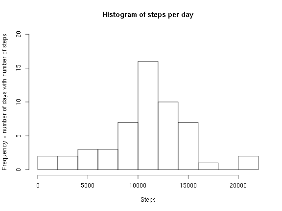
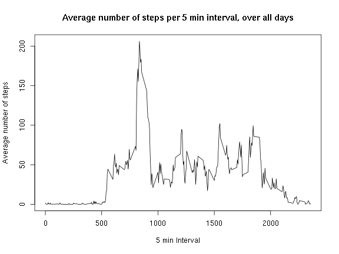
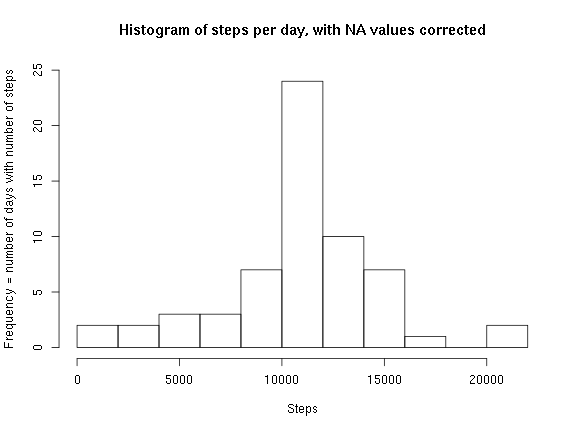
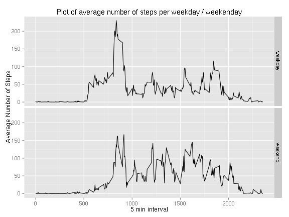

#Coursera Reproducible Research, Assignment 1


```r
library(knitr)
opts_chunk$set(echo=TRUE, results="show", fig.height=6, fig.width=8)
```

#part 1: Loading and preprocessing the data
Show any code that is needed to

- Load the data (i.e. read.csv())
- Process/transform the data (if necessary) into a format suitable for your analysis

##read the data
assume they are in your working directory, unzipped


```r
pfname="activity.csv"
df<-read.table(pfname, header=TRUE, sep=",", stringsAsFactors = FALSE)
```

#part 2: What is mean total number of steps taken per day?

- For this part of the assignment, you can ignore the missing values in the dataset.


##part 2.1: Calculate the total number of steps taken per day


```r
tmp<-aggregate(steps ~ date, data=df, FUN=sum)
```

##part 2.2: Make a histogram of the total number of steps taken each day


```r
title<-"Histogram of steps per day"
xlab<-"Steps"
ylab<-"Frequency = number of days with number of steps"
hist(tmp$steps, plot=TRUE, breaks=10, ylim=c(0,20), main=title, xlab=xlab, ylab=ylab)
```

 


##part 2.3 Calculate and report the mean and median of the total number of steps taken per day


```r
print(sprintf("mean = %s" , mean(tmp$steps)))
```

```
## [1] "mean = 10766.1886792453"
```

```r
print(sprintf("median = %s" , median(tmp$steps)))
```

```
## [1] "median = 10765"
```

#part 3: What is the average daily activity pattern?

##part 3.1: Make a time series plot (i.e. type = "l") of the 5-minute interval (x-axis) and the average number of steps taken, averaged across all days (y-axis)


```r
tmp<-aggregate(steps ~ interval, data=df, FUN=mean)
title<-"Average number of steps per 5 min interval, over all days"
xlab<-"5 min Interval"
ylab<-"Average number of steps"
with(tmp, plot(interval, steps, type='l', main=title, xlab=xlab, ylab=ylab))
```

 

##part 3.2: Which 5-minute interval, on average across all the days in the dataset, contains the maximum number of steps?


```r
idx<-which(tmp$steps==max(tmp$steps))
print(sprintf("5 min interval with maximum average number of steps= %s", tmp[idx,]$interval))
```

```
## [1] "5 min interval with maximum average number of steps= 835"
```

#part 4: Imputing missing values
###Note that there are a number of days/intervals where there are missing values (coded as NA). The presence of missing days may introduce bias into some calculations or summaries of the data.

##part 4.1: Calculate and report the total number of missing values in the dataset (i.e. the total number of rows with NAs)


```r
numNA<-sum(is.na(df$steps))
print(sprintf("number of rows with NA in steps = %s", numNA))
```

```
## [1] "number of rows with NA in steps = 2304"
```

##part 4.2: Devise a strategy for filling in all of the missing values in the dataset. The strategy does not need to be sophisticated. For example, you could use the mean/median for that day, or the mean for that 5-minute interval, etc.

- See extra tabulation at end which shows: 8 missing values per interval, 53 values present for each interval

- Decision: use the mean for each 5 min time period to imput missing value (mean over all days per interval)


```r
##msi=mean steps per interval
msi<-aggregate(steps ~ interval, data=df, FUN=mean)
```

##part 4.3: Create a new dataset that is equal to the original dataset but with the missing data filled in.


```r
##pseudocode
##for each row in dfc
##  if is.na(steps)
##  set steps = msi[dfc[row,]$interval,]$steps
##res<-lapply(c(1:100), FUN=function(x) {if (is.na(dfc[x,]$steps)) dfc[x,]$steps <<- msi[msi$interval == dfc[x,]$interval,]$steps} )
##as func, but slow
chsteps<-function(df, msi) {
  for (x in c(1:nrow(df)) )
    if (is.na(df[x,]$steps)) df[x,]$steps <- msi[msi$interval==df[x,]$interval,]$steps
    #print(msi[msi$interval==df[x,]$interval,]$steps)
  return(df)
} 

##dfchanged
dfc<-chsteps(df, msi)
```

##part 4.4:  Make a histogram of the total number of steps taken each day and Calculate and report the mean and median total number of steps taken per day. Do these values differ from the estimates from the first part of the assignment? What is the impact of imputing missing data on the estimates of the total daily number of steps?

###part 4.4.A:  Make a histogram of the total number of steps taken each day


```r
tmp<-aggregate(steps ~ date, data=dfc, FUN=sum)
title<-"Histogram of steps per day, with NA values corrected"
xlab<-"Steps"
ylab<-"Frequency = number of days with number of steps"
hist(tmp$steps, plot=TRUE, breaks=10, ylim=c(0,25), main=title, xlab=xlab, ylab=ylab)
```

 

###part 4.4.B: Calculate and report the mean and median total number of steps taken per day. 


```r
print(sprintf("NA corrected mean = %s" , mean(tmp$steps)))
```

```
## [1] "NA corrected mean = 10766.1886792453"
```

```r
print(sprintf("NA corrected median = %s" , median(tmp$steps)))
```

```
## [1] "NA corrected median = 10766.1886792453"
```

###part 4.4.C: Do these values differ from the estimates from the first part of the assignment? 

Answer: they do not differ significantly

###part 4.4.D: What is the impact of imputing missing data on the estimates of the total daily number of steps?

Answer: impact is neglible


#part 5: Are there differences in activity patterns between weekdays and weekends?
###For this part the weekdays() function may be of some help here. Use the dataset with the filled-in missing values for this part.

##part 5.1: Create a new factor variable in the dataset with two levels 'weekday' and 'weekend' indicating whether a given date is a weekday or weekend day.


```r
##use weekdays? gives full name of day, unwieldy
##weekdays(as.POSIXlt(dfc[1,]$date))
##[1] "Monday"
##
##better
##as.POSIXlt(dfc[1,]$date)$wday
##wday : 0 - 6 day of the week, starting on Sunday.
##weekend is therefore c(0,6), weekday c(1:5)
dfc$wday<-sapply(dfc$date,FUN=function(x) if (as.POSIXlt(x)$wday %in% c(0,6)) 1 else 0 )

##example
##factor(c(1,0,0,1,0), labels=c("u", "w"))
##[1] w u u w u
##turn into factor
dfc$wday<-factor(dfc$wday, labels=c("weekday", "weekend"))
```

##part 5.2: Make a panel plot containing a time series plot (i.e. type = "l") of the 5-minute interval (x-axis) and the average number of steps taken, averaged across all weekday days or weekend days (y-axis). See the README file in the GitHub repository to see an example of what this plot should look like using simulated data.


```r
tmp<-aggregate(steps ~ wday+interval, data=dfc, FUN=mean)
library(ggplot2)
title<-"Plot of average number of steps per weekday / weekenday"
xlab<-"5 min interval"
ylab<-"Average Number of Steps"
g <- ggplot(tmp, aes(x=interval, y=steps)) + geom_line()
g<- g + facet_grid(wday ~ .)
g<- g + ggtitle(title) + xlab(xlab) + ylab(ylab)
print(g)
```

 

#Technically THE END of the assignment

#Extra: tabulate number of NA and number of measured values for variable "steps" per interval averaged for all days

##calculation related to part 4, to decide how to impute missing values


```r
##make a new var wich tells if there is a NA=NoValue=1 or a VALUE=0
df$isna<-sapply(df$steps, FUN=function(x) {if (is.na(x)) 1 else 0} )
df$isna<-factor(df$isna, labels=c("Value", "NoValue"))

with(df, table(isna, interval))
```

```
##          interval
## isna       0  5 10 15 20 25 30 35 40 45 50 55 100 105 110 115 120 125 130
##   Value   53 53 53 53 53 53 53 53 53 53 53 53  53  53  53  53  53  53  53
##   NoValue  8  8  8  8  8  8  8  8  8  8  8  8   8   8   8   8   8   8   8
##          interval
## isna      135 140 145 150 155 200 205 210 215 220 225 230 235 240 245 250
##   Value    53  53  53  53  53  53  53  53  53  53  53  53  53  53  53  53
##   NoValue   8   8   8   8   8   8   8   8   8   8   8   8   8   8   8   8
##          interval
## isna      255 300 305 310 315 320 325 330 335 340 345 350 355 400 405 410
##   Value    53  53  53  53  53  53  53  53  53  53  53  53  53  53  53  53
##   NoValue   8   8   8   8   8   8   8   8   8   8   8   8   8   8   8   8
##          interval
## isna      415 420 425 430 435 440 445 450 455 500 505 510 515 520 525 530
##   Value    53  53  53  53  53  53  53  53  53  53  53  53  53  53  53  53
##   NoValue   8   8   8   8   8   8   8   8   8   8   8   8   8   8   8   8
##          interval
## isna      535 540 545 550 555 600 605 610 615 620 625 630 635 640 645 650
##   Value    53  53  53  53  53  53  53  53  53  53  53  53  53  53  53  53
##   NoValue   8   8   8   8   8   8   8   8   8   8   8   8   8   8   8   8
##          interval
## isna      655 700 705 710 715 720 725 730 735 740 745 750 755 800 805 810
##   Value    53  53  53  53  53  53  53  53  53  53  53  53  53  53  53  53
##   NoValue   8   8   8   8   8   8   8   8   8   8   8   8   8   8   8   8
##          interval
## isna      815 820 825 830 835 840 845 850 855 900 905 910 915 920 925 930
##   Value    53  53  53  53  53  53  53  53  53  53  53  53  53  53  53  53
##   NoValue   8   8   8   8   8   8   8   8   8   8   8   8   8   8   8   8
##          interval
## isna      935 940 945 950 955 1000 1005 1010 1015 1020 1025 1030 1035 1040
##   Value    53  53  53  53  53   53   53   53   53   53   53   53   53   53
##   NoValue   8   8   8   8   8    8    8    8    8    8    8    8    8    8
##          interval
## isna      1045 1050 1055 1100 1105 1110 1115 1120 1125 1130 1135 1140 1145
##   Value     53   53   53   53   53   53   53   53   53   53   53   53   53
##   NoValue    8    8    8    8    8    8    8    8    8    8    8    8    8
##          interval
## isna      1150 1155 1200 1205 1210 1215 1220 1225 1230 1235 1240 1245 1250
##   Value     53   53   53   53   53   53   53   53   53   53   53   53   53
##   NoValue    8    8    8    8    8    8    8    8    8    8    8    8    8
##          interval
## isna      1255 1300 1305 1310 1315 1320 1325 1330 1335 1340 1345 1350 1355
##   Value     53   53   53   53   53   53   53   53   53   53   53   53   53
##   NoValue    8    8    8    8    8    8    8    8    8    8    8    8    8
##          interval
## isna      1400 1405 1410 1415 1420 1425 1430 1435 1440 1445 1450 1455 1500
##   Value     53   53   53   53   53   53   53   53   53   53   53   53   53
##   NoValue    8    8    8    8    8    8    8    8    8    8    8    8    8
##          interval
## isna      1505 1510 1515 1520 1525 1530 1535 1540 1545 1550 1555 1600 1605
##   Value     53   53   53   53   53   53   53   53   53   53   53   53   53
##   NoValue    8    8    8    8    8    8    8    8    8    8    8    8    8
##          interval
## isna      1610 1615 1620 1625 1630 1635 1640 1645 1650 1655 1700 1705 1710
##   Value     53   53   53   53   53   53   53   53   53   53   53   53   53
##   NoValue    8    8    8    8    8    8    8    8    8    8    8    8    8
##          interval
## isna      1715 1720 1725 1730 1735 1740 1745 1750 1755 1800 1805 1810 1815
##   Value     53   53   53   53   53   53   53   53   53   53   53   53   53
##   NoValue    8    8    8    8    8    8    8    8    8    8    8    8    8
##          interval
## isna      1820 1825 1830 1835 1840 1845 1850 1855 1900 1905 1910 1915 1920
##   Value     53   53   53   53   53   53   53   53   53   53   53   53   53
##   NoValue    8    8    8    8    8    8    8    8    8    8    8    8    8
##          interval
## isna      1925 1930 1935 1940 1945 1950 1955 2000 2005 2010 2015 2020 2025
##   Value     53   53   53   53   53   53   53   53   53   53   53   53   53
##   NoValue    8    8    8    8    8    8    8    8    8    8    8    8    8
##          interval
## isna      2030 2035 2040 2045 2050 2055 2100 2105 2110 2115 2120 2125 2130
##   Value     53   53   53   53   53   53   53   53   53   53   53   53   53
##   NoValue    8    8    8    8    8    8    8    8    8    8    8    8    8
##          interval
## isna      2135 2140 2145 2150 2155 2200 2205 2210 2215 2220 2225 2230 2235
##   Value     53   53   53   53   53   53   53   53   53   53   53   53   53
##   NoValue    8    8    8    8    8    8    8    8    8    8    8    8    8
##          interval
## isna      2240 2245 2250 2255 2300 2305 2310 2315 2320 2325 2330 2335 2340
##   Value     53   53   53   53   53   53   53   53   53   53   53   53   53
##   NoValue    8    8    8    8    8    8    8    8    8    8    8    8    8
##          interval
## isna      2345 2350 2355
##   Value     53   53   53
##   NoValue    8    8    8
```

```r
##  
##Conclusion: 8 missing values per interval 
```


